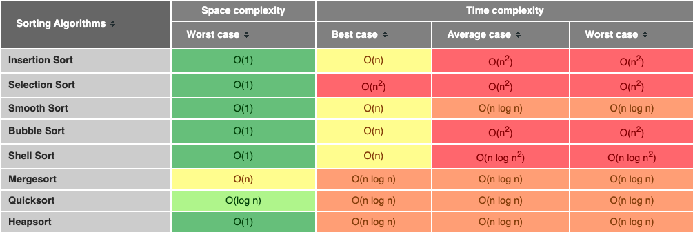
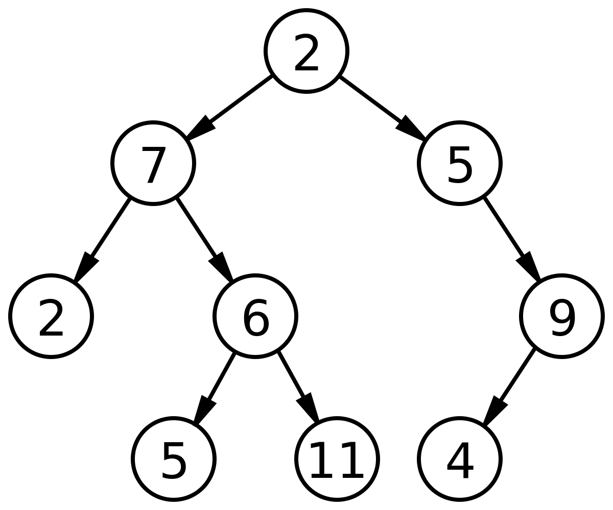
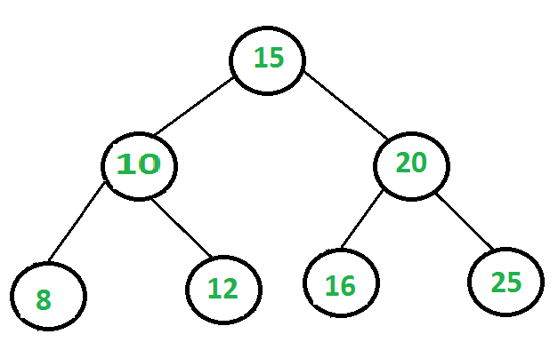
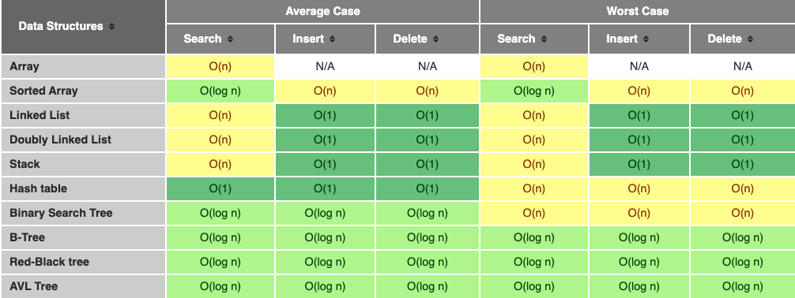

# Technical Interview Prep

Here are the sections:
* [How to Succeed in Data Structures and Algorithms Interview](#how-to-succeed-in-data-structures-and-algorithms-interview)
* [Algorithms](#algorithms)
* [Data Structures](#data-structures)
* [Curated LeetCode Questions](#curated-leetcode-questions)
* [AlgoExpert](#algoexpert)
* [Software Engineering](#software-engineering)
* [System Design](#system-design)

These are the best online resources that I used while preparing for technical coding interviews:

* [Cracking The Coding Interview](http://www.crackingthecodinginterview.com/): The most popular book on the whole tech interview process, now in 6th edition. 189 programming interview questions are included, ranging from the basics to the trickiest algorithm problems.
* [Elements of Programming Interviews](http://elementsofprogramminginterviews.com/): Another great book written by professional software engineers, with different versions in C++, Java and Python.
* [HackerRank](https://www.hackerrank.com/): A technical recruiting platform that assesses developers based on actual coding skills.
* [Pramp](https://www.pramp.com/): A free online peer-to-peer platform for practicing technical interviews.
* [LeetCode](https://leetcode.com/): One of the best online resource providing a rich library of more than 300 real coding interview questions with 7 supported languages - C, C++, Java, Python, C#, JavaScript, Ruby.
* [Interview Cake](https://www.interviewcake.com/): Another site that preps software engineering candidates for coding interview.
* [AlgoExpert](https://www.algoexpert.io/product): The ultimate resource to prepare for coding interviews. Everything you need, in one streamlined platform.
* [Software Engineering Interview Preparation](https://orrsella.gitbooks.io/soft-eng-interview-prep/content/): All the required theoretical material needed to pass a Facebook/Google software engineering interview.

## How to Succeed in Data Structures and Algorithms Interview

To practice your algorithmic coding, review [this interview preparation document](https://workera.ai/candidates/interview_prep/#h.skj5ir89g0z3).

* [Preparation](#preparation)
* [Understand the Problem](#understand-the-problem)
* [Brute Force Solution](#brute-force-solution)
* [Optimize Your Solution](#optimize-your-solution)
* [Code Your Solution](#code-your-solution)
* [Test Your Solution](#test-your-solution)

### Preparation

* **Develop a deep knowledge of data structures**: You should understand and be able to talk about different data structures and their strengths, weaknesses, and how they compare to each other. Taking the time to implement data structures from scratch will leave you much better prepared for DS&A interviews, than studying them as an abstract concept.
* **Understand Big O notation**: You should be able to talk about Big O notation for both time and space complexity. Make sure to read about common algorithms and their memory and runtime complexity to train your big O analysis muscle.
* **Know the major sorting algorithms**: Given that differences in time and space complexity can derail your optimal solution for an algorithm problem, it’s good to be familiar with the major algorithms per category (string matching, sorting, search, graph, traversal, etc).

[back to current section](#how-to-succeed-in-data-structures-and-algorithms-interview)

### Understand the Problem

* To verify your understanding, repeat the question back to the interviewer in your own words to make sure you got it correctly. There’s nothing worse than realizing mid-interview that you’re answering a completely different question. It could be helpful to use a test or two to verify your understanding of the problem.
* You should feel comfortable asking your interviewer questions to define any ambiguities and ask them if you can make certain assumptions (e.g. “Can I assume the array is sorted?” or “Can I assume the input is valid?”). Remember that the interviewer’s goal is to get a good signal for how you think through an issue or problem.
* You may consider asking them the following questions:
  - How large is the range of values? What kind of values exists?
  - How large is the size of the input? Are there duplicates within the input?
  - What are some extreme cases of inputs?
  - How is the input stored?
* You should also ask whether you’ll eventually be optimizing for time, space, or both. Even if you believe you already know how to solve the problem, it’s important to ensure that you’re spending your time implementing the solution that your interviewer cares about.
* Keep track of how much time you’re spending in the ideation phase to leave yourself enough time to code your solution.

[back to current section](#how-to-succeed-in-data-structures-and-algorithms-interview)

### Brute Force Solution

* The worst outcome in a technical interview is to not write any code, and the easiest way to end up in that position is to overcomplicate the problem early in the interview.
* Instead, talk through a solution you’re confident will work and let your interviewer know about the concessions you’ve made. You might think that if you present an initial suboptimal solution that you’ll never get hired, but this isn’t true. Communication is important here. You can score points with your interviewer by explaining the time and space complexity of your naive or brute-force solution and by clarifying why it’s suboptimal; you’ll have the chance to improve it later.
* Now that you’ve talked through the brute-force solution, ask the interviewer whether they’d like you to implement the brute force solution or come up with a more efficient solution. If the former, skip the next section “Optimize your Solution” and come back to it at the end. Only start coding once you and your interviewer have agreed on an approach and they’ve given you the green light to move ahead.

[back to current section](#how-to-succeed-in-data-structures-and-algorithms-interview)

### Optimize Your Solution

* Discuss your approach with your interviewer and lean on them to get a sense of whether they have a preference for whether you optimize for time, space, or both. When optimizing, some of your initial assumptions may change, so it’s important to check with your interviewer.
* You may see the most optimal solution right away or be unsure on how to proceed. If you’re stuck, here are some common approaches to optimizing:
  - Take a second look at the problem, its constraints, and write down your assumptions and possible simplifications.
  - Consider similar problems you’ve seen and discuss them with your interviewer.
  - Solve an example by hand and extrapolate about what algorithm(s) could be used.
  - Simulate the brute-force solution by hand and identify the inefficiencies that could be optimized with a data structure.
  - Solve a simple version of the problem first, then build on it.
* Don’t forget to communicate and analyze the time or space complexity of the solution you plan to optimize. Once you and your interviewer agree that you have a good solution, it’s time to code it.

[back to current section](#how-to-succeed-in-data-structures-and-algorithms-interview)

### Code Your Solution

* As an interviewee, it’s important to ensure that your interviewer understands what you’re doing and why you’re doing it in real-time. If you’re explaining your thought process out loud and you take a wrong turn, your interviewer may offer you a hint to get you back on track.
* While you’re coding, don’t read your code verbatim; but rather, talk about the section of the code you’re implementing at a higher level. Explain why you wrote it that way and what it’s trying to achieve.
* Remember that your interviewer needs to be able to understand your code to efficiently evaluate whether your code returns the expected result and solves the problem. As you code, keep these pointers in mind:
  - Use good style when writing your code.
  - Naming Matters.
  - Demonstrate good modularity.
  - Leave time to check for bugs and edge cases.
  - If cutting corners, explain it to your interviewer.
* Take a step back and briefly read through your solution, examining it as if it were written by someone else, but don’t start debugging it manually. This is the same approach that will be taken by your interviewer. Fix any issues you may find.
* Then walk your interviewer through the code and explain your rationale. If you find a bug or mistake, feel free to acknowledge it and make the change.

[back to current section](#how-to-succeed-in-data-structures-and-algorithms-interview)

### Test Your Solution

* During the testing portion of the interview, you should have a few goals in mind. You want to…
  - Demonstrate that you care that your code actually works.
  - Show that you can understand and solve problems even if it doesn’t work.
  - Exhibit your understanding of the various edge cases that a real-world problem might present.
  - Establish a feedback loop for your code that allows refactoring without having to worry about breaking existing functionality.
* There are a few types of inputs you’re going to test for:
  - Large and small valid inputs.
  - Large and small invalid inputs.
  - Random input.
* For each input, manually go through your code and ensure that it performs. You should jot down or tell your interviewer the values of each variable as you walk them through the code.
* If you find an error, explain the error to your interviewer, fix it, and move on. Similarly, if there are large duplicated code blocks in your solution, you can take the time to restructure the code.
* In this stage, you’ll also have the opportunity to showcase your knowledge around automated testing. You can chat about how you’d generate different types of inputs, how you would stub parts of the code, the test runners you’d use, and more. These are all great signals to show an interviewer.

[back to current section](#how-to-succeed-in-data-structures-and-algorithms-interview)

[back to top](#technical-interview-prep)

## Algorithms

Here are the algorithms:
* [Sorting](#sorting)
* [Tree Traversals](#tree-traversals)
* [Graph Traversals](#graph-traversals)
* [Backtracking](#backtracking)
* [Binary Search](#binary-search)
* [Breadth First Search](#breadth-first-search)
* [Depth First Search](#depth-first-search)
* [Recursion](#recursion)

### Sorting

#### Bubble Sort

- This simple sorting algorithm iterates over a list, comparing elements in pairs and swapping them until the larger elements "bubble up" to the end of the list, and the smaller elements stay at the "bottom".
- [Implementation](https://github.com/khanhnamle1994/technical-interview-prep/blob/master/Sorting-in-Python/bubble_sort.py)
- In the worst case scenario (when the list is in reverse order), this algorithm would have to swap every single item of the array. Therefore, if we have n elements in our list, we would have n iterations per item - thus Bubble Sort's time complexity is O(n^2).


#### Selection Sort

- This algorithm segments the list into two parts: sorted and unsorted. We continuously remove the smallest element of the unsorted segment of the list and append it to the sorted segment.
- [Implementation](https://github.com/khanhnamle1994/technical-interview-prep/blob/master/Sorting-in-Python/selection_sort.py)
- For a list with n elements, the outer loop iterates n times. The inner loop iterate n-1 when i is equal to 1, and then n-2 as i is equal to 2 and so forth. The amount of comparisons are `(n - 1) + (n - 2) + ... + 1`, which gives Selection Sort a time complexity of O(n^2).


#### Insertion Sort

- Like Selection Sort, this algorithm segments the list into sorted and unsorted parts. It iterates over the unsorted segment, and inserts the element being viewed into the correct position of the sorted list.
- [Implementation](https://github.com/khanhnamle1994/technical-interview-prep/blob/master/Sorting-in-Python/insertion_sort.py)
- In the worst case scenario, an array would be sorted in reverse order. The outer for loop in Insertion Sort function always iterates n-1 times. In the worst case scenario, the inner for loop would swap once, then swap two and so forth. The amount of swaps would then be `1 + 2 + ... + (n - 3) + (n - 2) + (n - 1)` which gives Insertion Sort a time complexity of O(n^2).


#### Heap Sort

- This popular sorting algorithm, like the Insertion and Selection sorts, segments the list into sorted and unsorted parts. It converts the unsorted segment of the list to a Heap data structure, so that we can efficiently determine the largest element.
- [Implementation](https://github.com/khanhnamle1994/technical-interview-prep/blob/master/Sorting-in-Python/heap_sort.py)
- Let's first look at the time complexity of the `heapify` function. In the worst case the largest element is never the root element, this causes a recursive call to `heapify`. While recursive calls might seem dauntingly expensive, remember that we're working with a binary tree. Visualize a binary tree with 3 elements, it has a height of 2. Now visualize a binary tree with 7 elements, it has a height of 3. The tree grows logarithmically to n. The `heapify` function traverses that tree in O(log(n)) time.
- The `heap_sort` function iterates over the array n times. Therefore the overall time complexity of the Heap Sort algorithm is O(nlog(n)).

#### Merge Sort

- This divide and conquer algorithm splits a list in half, and keeps splitting the list by 2 until it only has singular elements. Adjacent elements become sorted pairs, then sorted pairs are merged and sorted with other pairs as well. This process continues until we get a sorted list with all the elements of the unsorted input list.
- [Implementation](https://github.com/khanhnamle1994/technical-interview-prep/blob/master/Sorting-in-Python/merge_sort.py)
- Let's first look at the `merge` function. It takes two lists, and iterates n times, where n is the size of their combined input.
- The `merge_sort` function splits its given array in 2, and recursively sorts the sub-arrays. As the input being recursed is half of what was given, like binary trees this makes the time it takes to process grow logarithmically to n. Therefore the overall time complexity of the Merge Sort algorithm is O(nlog(n)).


#### Quick Sort

- This divide and conquer algorithm is the most often used sorting algorithm. When configured correctly, it's extremely efficient and does not require the extra space Merge Sort uses. We partition the list around a pivot element, sorting values around the pivot.
- [Implementation](https://github.com/khanhnamle1994/technical-interview-prep/blob/master/Sorting-in-Python/quick_sort.py)
- The worst case scenario is when the smallest or largest element is always selected as the pivot. This would create partitions of size n-1, causing recursive calls n-1 times. This leads us to a worst case time complexity of O(n^2).
- While this is a terrible worst case, Quick Sort is heavily used because it's average time complexity is much quicker. While the `partition` function utilizes nested while loops, it does comparisons on all elements of the array to make its swaps. As such, it has a time complexity of O(n).
- With a good pivot, the Quick Sort function would partition the array into halves which grows logarithmically with n. Therefore the average time complexity of the Quick Sort algorithm is O(nlog(n)).


**Time Complexities of All Sorting Algorithms**



[back to current section](#algorithms)

### Tree Traversals

Tree traversals are commonly used in interviews. Learn about pre-order, in-order and post-order traversal in [this video](https://www.coursera.org/lecture/data-structures/tree-traversal-fr51b).

* Often we want to visit the nodes of a tree in a particular order (for example, print the nodes of the tree)
* Depth-First: We completely traverse one sub-tree before exploring a sibling sub-tree (pre-oder, in-order, post-order).
* Breadth-First: We traverse all nodes at one level before progressing to the next level.
* When working with a tree, recursive algorithms are common.

**Depth-First**

```
InOrderTraversal(tree)

if tree = nil: return
InOrderTraversal(tree.left)
Print(tree.key)
InOrderTraversal(tree.right)
```

```
PreOrderTraversal(tree)

if tree = nil: return
Print(tree.key)
PreOrderTraversal(tree.left)
PreOrderTraversal(tree.right)
```

```
PostOrderTraversal(tree)

if tree = nil: return
PostOrderTraversal(tree.left)
PostOrderTraversal(tree.right)
Print(tree.key)
```

**Breadth-First**

```
LevelTraversal(tree)

if tree = nil: return
Queue q
q.Enqueue(tree)
while not q.Empty():
  node <- q.Dequeue()
  Print(node)
  if node.left != nil:
    q.Enqueue(node.left)
  if node.right != nil:
    q.Enqueue(node.right)
```

[back to current section](#algorithms)

### Graph Traversals

- The process of **searching** through or **traversing** through a graph data structure involves visiting each vertex/node in a graph. The order in which vertices are visited is how we can classify graph traversals.
- A Quick Review:
  - **BFS** traverses broad into a structure by visiting sibling/neighbor nodes before children nodes. It uses a queue data structure.
  - **DFS**: traverses deep into a structure by visiting children nodes before visiting sibling/neighbor nodes. It uses a stack data structure.
- Graph traversal can begin with any node, since there is no concept of a root node.

**BFS Traversal**
- A unique thing about BFS is that it lends itself quite nicely to determining the **shortest path** between any node in the graph and the “parent” node.
  - In fact, most BFS implementations will keep track of every single node’s “parent” nodes that come before it.
  - This is helpful because we can use the pointers of the path that we take to get to a node from the starting node in order to determine a shortest path in the graph.
- The power of using breadth-first search to traverse through a graph is that it can easily tell us the **shortest** way to get from one node to another.
- If we must visit every node once, and check every edge in its adjacency list, the runtime complexity for both a directed and undirected graph is the sum of the vertices and their edges as represented by the graph in its adjacency list representation, or **O(V + E)**.

**DFS Traversals**
- While BFS will traverse through a graph one level of children at a time, DFS will traverse down a single path, one child node at a time.
  - BFS is good to find a shortest path.
  - DFS tells us if a path even exists.
- DFS is like solving a maze:
  - We'll continue to walk through the path of the maze until we reach a dead end.
  - When we do reach a dead end, we backtrack until we find another path we haven't walked yet, and repeat.
  - Eventually, we will be able to determine if we can get out of the maze.
- DFS requires **O(V + E)** runtime:
  - For a directed graph, |E| edges to check.
  - For an undirected graph, 2|E| edges (each edge is visited twice).

**Pros and Cons**
- DFS:
  - Not helpful in finding shortest paths. We could end up following the longest path from node x to y!
  - But if the graph is deep enough, it can be great since we don't need to store the entire thing in memory!
- BFS:
  - Can be great to find the shortest path possible.
  - But if the graph is wide, we'd need to store all of it, level by level, with references and using memory unnecessarily!

[back to current section](#algorithms)

### Backtracking

Learn about backtracking in [this video](https://www.youtube.com/watch?v=gBC_Fd8EE8A):
* Backtracking solves problems by trying a series of actions. If a series fails, we back up and try a different series.
* A maze is a classic example, but the approach can be used on a wide variety of problems.
* The recursive solution may be elegant, but remember not to dwell on the backtracking concept or what the recursion is doing.

[back to current section](#algorithms)

### Binary Search

Binary search is an efficient algorithm for finding an item from a sorted list of items. It works by repeatedly dividing in half the portion of the list that could contain the item, until you've narrowed down the possible locations to just one.

We basically ignore half of the elements just after one comparison.
1. Compare x with the middle element.
2. If x matches with middle element, we return the mid index.
3. Else If x is greater than the mid element, then x can only lie in right half subarray after the mid element. So we recur for right half.
4. Else (x is smaller) recur for the left half.

[Recursive](https://github.com/khanhnamle1994/technical-interview-prep/blob/master/Search-in-Python/binary_search_recursive.py) and [Iterative](https://github.com/khanhnamle1994/technical-interview-prep/blob/master/Search-in-Python/binary_search_iterative.py) Implementation


[back to current section](#algorithms)

### Breadth First Search

Breadth First Search (BFS) is a widely used interview question. Learn about it in [this video](https://www.coursera.org/lecture/algorithms-part2/breadth-first-search-DjaET). It is an algorithm used for tree traversal on graphs or tree data structures. BFS can be easily implemented using recursion and data structures like dictionaries and lists.

**The Algorithm**

1. Pick any node, visit the adjacent unvisited vertex, mark it as visited, display it, and insert it in a queue.
2. If there are no remaining adjacent vertices left, remove the first vertex from the queue.
3. Repeat step 1 and step 2 until the queue is empty or the desired node is found.

- [Implementation](https://github.com/khanhnamle1994/technical-interview-prep/blob/master/Search-in-Python/bfs.py )
- Since all of ​the nodes and vertices are visited, the time complexity for BFS on a graph is O(V + E); where V is the number of vertices and E is the number of edges.

[back to current section](#algorithms)

### Depth First Search

Depth First Search (DFS) is a widely used interview question. Learn about it in [this video](https://www.coursera.org/lecture/algorithms-part2/depth-first-search-mW9aG). It is an algorithm for tree traversal on graph or tree data structures. It can be implemented easily using recursion and data structures like dictionaries and arrays.

**The Algorithm**
1. Pick any node. If it is unvisited, mark it as visited and recur on all its adjacent nodes.
2. Repeat until all the nodes are visited, or the node to be searched is found.

- [Implementation](https://github.com/khanhnamle1994/technical-interview-prep/blob/master/Search-in-Python/dfs.py)
- Since all of ​the nodes and vertices are visited, the time complexity for DFS on a graph is O(V + E); where V is the number of vertices and E is the number of edges. In case of DFS on a tree, the time complexity is O(V), where V is the number of nodes.

[back to current section](#algorithms)

### Recursion

Learn about recursion in [this video](https://www.coursera.org/lecture/principles-of-computing-2/recursion-ccrwD):
* Used when problems exhibit common sub-structures.
* SumUpTo(n): Base case = 1 when n = 1; Recursive/Inductive case = n + SumUpTo(n - 1) when n > 1

```
def sum_up_to(n):
  if n == 1: return 1
  else: return n + sum_up_to(n - 1)

def is_palindrome(word):
  if len(word) < 2: return True
  else:
    if word[0] != word[-1]: return False
    else: return is_palindrome(word[1:-1])
```

[back to current section](#algorithms)

[back to top](#technical-interview-prep)

## Data Structures

Here are [the most commonly used data structures](https://www.freecodecamp.org/news/the-top-data-structures-you-should-know-for-your-next-coding-interview-36af0831f5e3/):

1. [Arrays](#arrays)
2. [Stacks](#stacks)
3. [Queues](#queues)
4. [Linked Lists](#linked-lists)
5. [Trees](#trees)
6. [Graphs](#graphs)
7. [Hash Tables](#hash-tables)
8. [Set](#set)
9. [Heaps](#heaps)
10. [Tries](#tries)
11. [Comparisons](#comparisons)

### Arrays

An array is the simplest and most widely used data structure. Other data structures like stacks and queues are derived from arrays.

Here’s an image of a simple array of size 4, containing elements (1, 2, 3 and 4).


Each data element is assigned a positive numerical value called the ≈Index**, which corresponds to the position of that item in the array. The majority of languages define the starting index of the array as 0.

Basic Operations on Arrays:
* **Insert** — Inserts an element at given index: O(n)
* **Get** — Returns the element at given index: O(n)
* **Delete** — Deletes an element at given index: O(n)
* **Size** — Get the total number of elements in array: O(1)

**Commonly Asked Array Interview Questions**:
1. *Find the second minimum element of an array*

  - A **simple solution** is to sort the array in increasing order. The first 2 elements in sorted array would be 2 smallest elements. Time complexity is O(n logn).
  - A **better solution** is to scan the array twice. In 1st traversal, find the minimum element. Let this element be x. In 2nd traversal, find the smallest element greater than x. Time complexity of this solution is O(n).
  - An **efficient solution** can find the minimum 2 elements in one traversal.

  ```
  1> Initialize both first and second smallest as INT_MAX
  2> Loop through all elements:
    a> If the current element is smaller than the first, then update first and second.
    b> Else if the current element is smaller than second, then update second.
  ```

2. *Find the first non-repeating element in an array of integers*

  - A **simple solution** is to use 2 loops. The outer loop picks elements one by one and inner loop checks if the element is present more than once or not.
  - An **efficient solution** is to use hashing: (1) Traverse array and insert elements and their counts in a hash table. (2) Traverse array again and print first element with count equals to 1.
  - **Further optimization**: If array has many duplicates, we can also store index in hash table, using a hash table where value is a pair. Now we only need to traverse keys in hash table to find first non-repeating.

3. *Merge two sorted arrays*

  - The idea is to use **Merge** function of **Merge sort** - O(n1 + n2) time and O(n1 + n2) space
    - Create a new array arr3[] of size n1 + n2.
    - Simultaneously traverse arr1[] and arr2[]
      - Pick smaller of current elements in arr1[] and arr2[], copy this smaller element to next position in arr3[] and move ahead in arr3[] and the array whose element is picked.
    - If there are remaining elements in arr1[] or arr2[], copy them also in arr3[].


4. *Remove even integers from an array*

[back to current section](#data-structures)

### Stacks

- A real-life example of Stack could be a pile of books placed in a vertical order. In order to get the book that’s somewhere in the middle, you will need to remove all the books placed on top of it. This is how the LIFO (Last In First Out) method works.
- Stacks are often implemented by using a linked list! Because they can only “grow” in one direction — that is to say, they only allow us to add and remove elements through a single place — they lend themselves easily to behaving exactly like *singly linked lists*.
- If we remember the characteristics of a linked list, we’ll recall that they have a head node, and that the space time complexity of adding elements to the beginning of the linked list is O(1), or *constant time*. That’s really nice, because no matter how big our stack might get, since we’re only adding and removing from the top (our head node), we can perform that single operation in relatively the same amount of time, even with a large stack.
- What happens when you implement a stack using an array as our data structure? Well, if we try to add more elements to our stack than our array has space for…things turn real bad, real fast. Our stack won’t prevent us from adding another element (since it thinks that it can grow as large as it wants), but the array that’s implementing the stack won’t have the space that’s required to allocate enough memory to the new element that we’re adding! All of this leads to — you guessed it — a *stack overflow*!

Here’s an image of stack containing three data elements (1, 2 and 3), where 3 is at the top and will be removed first:


Basic Operations of Stack:
* **Push** — Inserts an element at the top: O(1)
* **Pop** — Returns the top element after removing from the stack: O(1)
* **isEmpty** — Returns true if the stack is empty: O(1)
* **Top** — Returns the top element without removing from the stack: O(1)

```
class Stack:

    def __init__(self):
        self.stack = []

    def add(self, dataval):
        # Use list append method to add element
        if dataval not in self.stack:
            self.stack.append(dataval)
            return True
        else:
            return False

    def peek(self):
        # Use peek to look at the top of the stack
	       return self.stack[-1]

    def remove(self):
        # Use list pop method to remove element
        if len(self.stack) <= 0:
            return ("No element in the Stack")
        else:
            return self.stack.pop()
```

**Commonly Asked Stack Interview Questions**:
1. *Implement two stacks using one array*

2. *Sort values in a stack*

3. *Check balanced parentheses in an expression*

[back to current section](#data-structures)

### Queues

- Similar to Stack, Queue is another linear data structure that stores the element in a sequential manner. The only significant difference between Stack and Queue is that instead of using the LIFO method, Queue implements the FIFO method, which is short for First in First Out.
- A perfect real-life example of Queue: a line of people waiting at a ticket booth. If a new person comes, they will join the line from the end, not from the start — and the person standing at the front will be the first to get the ticket and hence leave the line.
- Arrays can be very powerful when we know the size of our data structure ahead of time. But there a many times (in particular with queues) when we don’t really know how big our queue is going to get. So what happens when we have to enqueue an element? Well, if we don’t know the queue size beforehand and we’re using an array, it’s probable that sooner rather than later, we’ll run out of allocated memory and space. So, we’ll need to copy over the contents of our array and then allocate more space and memory, and then enqueue a new element onto the end of the queue.
- But there’s yet another added complexity with array-based queue implementations: we need to be able to enqueue at the back of the array, and dequeue from the front — which isn’t always terrible because accessing the first or last element in an array doesn’t take too much time, but it’s not as simple as with stacks, where the adding and removing of elements all happens from one end of the structure. As our array grows, we’ll need to be able to access one end and the other, and the space time complexity will grow as a result.
- We can implement the queue with a *linked list*. We don’t need to worry about the queue size ahead of time, since memory can be distributed and the linked list implementation of our queue can grow dynamically (just as long as we don’t use all of our computer’s memory).
- Enqueuing and dequeuing gets to be a lot easier, because we can simply find an empty space in memory, add a node with a reference to it’s next neighbor. No need to copy and recreate our queue like we had to with an array implementation. And, if we add pointer references to the beginning and end of our list, we don’t need to traverse the entire structure to enqueue or dequeue an element, either!

Here’s an image of Queue containing four data elements (1, 2, 3 and 4), where 1 is at the top and will be removed first:


Basic Operations of Queue:
* **Enqueue()** — Inserts element to the end of the queue: O(1)
* **Dequeue()** — Removes an element from the start of the queue: O(1)
* **isEmpty()** — Returns true if queue is empty: O(1)
* **Top()** — Returns the first element of the queue: O(1)

A queue can be implemented using python list where we can use the insert() and pop() methods to add and remove elements. Their is no insertion as data elements are always added at the end of the queue.

```
class Queue:

    def __init__(self):
        self.queue = list()

    def addtoq(self,dataval):
        # Insert method to add element
        if dataval not in self.queue:
            self.queue.insert(0,dataval)
            return True
        return False

    def size(self):
        return len(self.queue)

    # Pop method to remove element
    def removefromq(self):
        if len(self.queue)>0:
            return self.queue.pop()
        return ("No elements in Queue!")
```

**Commonly Asked Queue Interview Questions**:
1. *Implement stack using a queue*

2. *Reverse first k elements of a queue*

3. *Generate binary numbers from 1 to n using a queue*

[back to current section](#data-structures)

### Linked Lists
- A linked list is another important linear data structure which might look similar to arrays at first but differs in memory allocation, internal structure and how basic operations of insertion and deletion are carried out.
- A linked list is like a chain of nodes, where each node contains information like data and a pointer to the succeeding node in the chain. There’s a head pointer, which points to the first element of the linked list, and if the list is empty then it simply points to null or nothing.
- Linked lists are used to implement file systems, hash tables, and adjacency lists.

Here’s a visual representation of the internal structure of a linked list:


Following are the types of linked lists:
* Singly Linked List (Unidirectional)
* Doubly Linked List (Bi-directional)

Basic Operations of Linked List:
* **InsertAtEnd** — Inserts given element at the end of the linked list: O(1)
* **InsertAtHead** — Inserts given element at the start/head of the linked list: O(1)
* **Delete** — Deletes given element from the linked list: O(1)
* **DeleteAtHead** — Deletes first element of the linked list: O(1)
* **Search** — Returns the given element from a linked list: O(n)
* **isEmpty** — Returns true if the linked list is empty: O(1)

A good rule of thumb for remember the characteristics of linked lists is this: **a linked list is usually efficient when it comes to adding and removing most elements, but can be very slow to search and find a single element.**
- If you ever find yourself having to do something that requires a lot of traversal, iteration, or quick index-level access, a linked list could be your worst enemy. In those situations, an *array* might be a better solution, since you can find things quickly (a single chunk of allocated memory), and you can use an index to quickly retrieve a random element in the middle or end of the list without having to take the time to traverse through the whole entire thing.
- However, if you find yourself wanting to add a bunch of elements to a list and aren’t worried about finding elements again later, or if you know that you won’t need to traverse through the entirety of the list, a linked list could be your new best friend.

**Commonly Asked Linked List Interview Questions**:
1. *Reverse a linked list*

2. *Detect loop in a linked list*

3. *Return Nth node from the end in a linked list*

4. *Remove duplicates from a linked list*

5. *Find the length of a linked list*

6. *Find the middle value of a linked list*

[back to current section](#data-structures)

### Trees

- A tree is a hierarchical data structure consisting of vertices (nodes) and edges that connect them. Trees are similar to graphs, but the key point that differentiates a tree from the graph is that a cycle cannot exist in a tree.
- Trees are extensively used in Artificial Intelligence and complex algorithms to provide an efficient storage mechanism for problem-solving.
- Here are some good terms to know when it comes to talking about trees:
  - **Root**: the topmost node of the tree, which never has any links or edges connecting to it
  - **Link/Edge**: the reference that a parent node contains that tells it what its child node is
  - **Child**: any node that has a parent node that links to it
  - **Parent**: any node that has a reference or link to another node
  - **Sibling**: any group of nodes that are the children of the same node
  - **Internal**: any node that has a child node (basically all parent nodes)
  - **Leaf**: any node that does not have a child node in the tree
- *If a tree has n nodes, it will always have one less number of edges (n-1).*
- Trees are *recursive data structures* because a tree is usually composed of smaller trees — often referred to as subtrees — inside of it. The child of one node in a tree could very well be the parent of another tree (making it the root node of a subtree). This can be really interesting when it comes to writing algorithms to traverse or search through a tree, since the nesting of trees can sometimes lead us to writing recursive search algorithms.
- For the most part, the two properties that we will be the most concerned with are either the depth of a node or the height of a node.
  - A simple way to think about the **depth** of a node is by answering the question: how far away is the node from the root of the tree?
  - The **height** of a node can be simplified by asking the question: how far is this node from its furthest-away leaf?
- The reason that depth and height are so important is because they tell us a lot about what a tree looks like, right off the bat. And the thing about trees is that they can all look different. One quick example of this is balanced trees versus unbalanced trees.
  - A tree is considered to be **balanced** if any two sibling subtrees do not differ in height by more than one level.
  - However, if two sibling subtrees differ significantly in height (and have more than one level of depth of difference), the tree is **unbalanced**.

Here’s an image of a simple tree, and basic terminologies used in tree data structure:


The following are the types of trees:
* N-ary Tree
* Balanced Tree
* Binary Tree
* Binary Search Tree
* AVL Tree
* Red Black Tree
* 2–3 Tree

Out of the above, Binary Tree and Binary Search Tree are the most commonly used trees.

A **binary tree** is a non linear data structure where each node can have at most 2 child nodes.



- If a node have 0 child nodes then it is called a leaf node. In the above image {2,5,11,4} are the leaf nodes.
- The worst case complexity for searching a node is O(n).

**Binary search tree** is a binary tree in which a node have a value greater than all values in its left subtree and smaller than all values in its right subtree.



- If a Binary search tree is balanced then you can find a value in O(log n) time.
- Let's say we want to find node 12:
  - We will start from the root node which in this case is 15.
  - Current node is 15, but 12<15 , we go in the left subtree because right subtree has even greater values.
  - Current node is 10, but 12>10 , we go in the right subtree because left subtree has even smaller values.
  - Current node is 12. BOOM!

**Commonly Asked Tree Interview Questions**:
1. *Find the height of a binary tree*

Recursively calculate the height of left and right subtrees of a node and assign the height to the node as max of the heights of 2 children plus 1.

```
1 - If tree is empty, then return 0
2 - Else
  (a) Get the max depth of left subtree recursively
  (b) Get the max depth of right subtree recursively
  (c) Get the max of max depths of left and right subtrees and add 1 to it for the current node
  (d) Return max_depth
```

2. *Find nodes at “k” distance from the root*

```
def printKDistance(root, k):
  if root is None: return
  if k == 0:
    print(root.data)
  else:
    printKDistance(root.left, k - 1)
    printKDistance(root.right, k - 1)
```

3. *Find ancestors of a given node in a binary tree*

```
def printAncestors(root, target):

  # Base case
  if root == None: return False
  if root.data == target: return True

  # If target is present in either left or right subtree of this node, then print this node
  if (printAncestors(root.left, target) or printAncestors(root.right, target)):
    print(root.data)
    return True

  return False
```

[back to current section](#data-structures)

### Graphs

A **graph** is a data structure that consists of a finite set of **vertices**, which are also called **nodes**, and a set of **edges**, which are references/links between the vertices. The edges of a graph are represented as ordered or unordered pairs, depending on whether or not the graph is **directed** or **undirected**.


- There are two types of graphs:
  - In an **undirected graph**, there is no order to the edges, since it's possible to travel from one vertex to the other.
  - In a **directed graph**, there is a directional flow that's important to how the graph is structured, and therefore, the edge set is represented as ordered pairs.

- An **edge list** is a list/array of all of the |E| edges in a graph. Edge lists are one of the simplest representations of a graph.
  - It would take **O(E)** to find one particular edge.
  - The space of representing an edge list is also going to be **O(E)**!

- An **adjacency matrix** is a matrix that represents exactly which vertices/nodes in a graph have edges between them. The matrix serves as a lookup table, where a value of **1** represents an edge that exists, and **0** represents an edge that does not.
  - They are easy to follow and represent. Looking up, inserting, and removing an edge can be done in **O(1)** (**constant** time).
  - However, they can take up more space than necessary. An adjacency matrix always consumes **O(V^2)** amount of space.
  - If a graph is **dense** and has many edges, this isn't too bad. But if a graph has few edges and is **sparse**, the matrix will be mostly filled with **0**'s, but take up lots of space!

- An **adjacency list** is an array of linked lists that servers the purpose of representing a graph, but also makes it easy to see which other vertices are adjacent to other vertices. Each vertex in a graph can easily reference its neighbors through a **linked list**.
  - Retrieving one vertex's possible neighbors takes **O(1)** time, sine we only need the vertex's index to get its list of adjacent neighbors.
  - To find a specific edge **(x, y)**, we need to find vertex **x**'s adjacency list, which takes constant time, and look to see if **y** is in that list.
  - In the worst case, this takes **O(d)** time, where **d** is the degree of vertex **v**.
  - An adjacency list will require **|V|** amount of space for the list itself, as every vertex must be represented in the list.

A graph can be easily presented using the python dictionary data types. We represent the vertices as the keys of the dictionary and the connection between the vertices also called edges as the values in the dictionary. Here are basic operations:
* To **display graph vertices**, we simple find the keys of the graph dictionary. We use the keys() method.
* To **find graph edges**, we have to find each of the pairs of vertices which have an edge in between them. So we create an empty list of edges then iterate through the edge values associated with each of the vertices. A list is formed containing the distinct group of edges found from the vertices.
* To **add a vertex**, we add another additional key to the graph dictionary.
* To **add an edge** to an existing graph, we treat the new vertex as a tuple and validating if the edge is already present. If not then the edge is added.

Take a look at the following graph:


In the above graph:

```
V = {a, b, c, d, e}
E = {ab, ac, bd, cd, de}
```

```
class graph:
    def __init__(self,gdict=None):
        if gdict is None:
            gdict = []
        self.gdict = gdict

    # Get the keys of the dictionary
    def getVertices(self):
        return list(self.gdict.keys())

    def edges(self):
        return self.findedges()

    # Find the distinct list of edges
    def findedges(self):
        edgename = []
        for vrtx in self.gdict:
            for nxtvrtx in self.gdict[vrtx]:
                if {nxtvrtx, vrtx} not in edgename:
                    edgename.append({vrtx, nxtvrtx})
        return edgename

    # Add the vertex as a key
    def addVertex(self, vrtx):
           if vrtx not in self.gdict:
                self.gdict[vrtx] = []

    # Add the new edge
    def AddEdge(self, edge):
        edge = set(edge)
        (vrtx1, vrtx2) = tuple(edge)
        if vrtx1 in self.gdict:
            self.gdict[vrtx1].append(vrtx2)
        else:
            self.gdict[vrtx1] = [vrtx2]

# Create the dictionary with graph elements
graph_elements = { "a" : ["b","c"],
                "b" : ["a", "d"],
                "c" : ["a", "d"],
                "d" : ["e"],
                "e" : ["d"]
                }

g = graph(graph_elements)
```

**Commonly Asked Graph Interview Questions**:
1. *Implement Breadth and Depth First Search:*
  - [BFS](https://github.com/khanhnamle1994/technical-interview-prep/blob/master/Search-in-Python/bfs.py)
  - [DFS](https://github.com/khanhnamle1994/technical-interview-prep/blob/master/Search-in-Python/dfs.py)

2. *Check if a graph is a tree or not*

3. *Count number of edges in a graph*

4. *Find the shortest path between two vertices*

5. *Detect cycle in a graph*

[back to current section](#data-structures)

### Hash Tables

Hashing is a process used to uniquely identify objects and store each object at some pre-calculated unique index called its “key.” So, the object is stored in the form of a “key-value” pair, and the collection of such items is called a “dictionary.” Each object can be searched using that key. There are different data structures based on hashing, but the most commonly used data structure is the **hash table**.

Hash tables are made up of two distinct parts: **an array** (which is the actual table where the data will be stored) and **a hash function** (which is responsible for taking input data and creating a mapping by assigning it a very specific index in the array). Its search, insert, and delete operations all take O(1) average complexity and O(n) worst complexity.

What makes a good hash table?
- **It should be easy to compute**. Hard-to-compute hash functions mean that we lose any gained advantages for quick and efficient lookup time!
- **It should avoid collision**. Collisions are unavoidable but the more collisions, the harder it is to come up with a fast, efficient algorithm for resolving them!
- **It should use all the input data, and always return the same key for the same hash bucket per value**. If a hash function doesn't always return the same value for any given input, we'll never be able to reliably access data from it!

The performance of hashing data structure depends upon these three factors:
- **Hash Function**: A function that maps a big number or string to a small integer that can be used as the index in the hash table.
- **Size of the Hash Table**: Changing the size of the hash table will change the compression function, leading to the keys being allotted to different buckets.
- **Collision Handling Method**: Hash function may return the same hash value for 2 or more keys (collision). We can resolve this problem either via separate chaining or open addressing.

The two most common collisions resolution tactics are:
- **Linear Probing**:
  - If a hash function encounters a collision, it can resolve it by finding the next available hash bucket for the data, and effectively probing through the table until it finds an empty space.
  - The downside to linear probing is its tendency for clustering. A poorly-designed hash table will "cluster" a majority of its input data into only a few hash buckets. If the hash bucket at the next key is also not available, the hash function loops back through the table.
- **Chaining**:
  - If a hash function encounters a collision, it can resolve it by using a linked list to store a collection of data at one hash bucket key, meaning that it can simply chain on more data to the same slot in the hash table.
  - The downside to chaining is that it takes more time to search with more items at one location - O(n) - where n is the number of items in the hash bucket.
  - With a good hash function, chaining still averages out to have a search time of O(1).

Here’s an illustration of how the hash is mapped in an array. The index of this array is calculated through a Hash Function.


In Python, the Dictionary data types represent the implementation of hash tables. Here are basic operations:
* To **access** dictionary elements, you can use the familiar square brackets along with the key to obtain its value.
* You can *update* a dictionary by adding a new entry or a key-value pair, modifying an existing entry, or deleting an existing entry.
* You can either remove individual dictionary elements or clear the entire contents of a dictionary. You can also **delete** entire dictionary in a single operation. To explicitly remove an entire dictionary, just use the `del` statement.

```
# Declare a dictionary
dict = {'Name': 'Zara', 'Age': 7, 'Class': 'First'}

# Accessing the dictionary with its key
print "dict['Name']: ", dict['Name']
print "dict['Age']: ", dict['Age']

dict['Age'] = 8; # update existing entry
dict['School'] = "DPS School"; # Add new entry

del dict['Name']; # remove entry with key 'Name'
dict.clear();     # remove all entries in dict
del dict ;        # delete entire dictionary
```

**Commonly Asked Hashing Interview Questions**:
* Find symmetric pairs in an array
* Trace complete path of a journey
* Find if an array is a subset of another array
* Check if given arrays are disjoint

[back to current section](#data-structures)

### Set

A **set** is nothing more than an unordered collection of elements with absolutely no duplicates.

Here are basic operations:
- **Intersection**: *X and Y* yields another set of all the elements that are both in X and Y.
- **Union**: *X or Y* yields another set of all the elements that are either in X or in Y.
- **Set Differences**: *X - Y* yields the difference between two sets, or all the elements in set X that are not in set Y.
- **Relative Complement**: *Y \ X* yields a set with all of the elements in set Y that do not also exist in set X.
- **Symmetric Difference / Disjunctive Union**: *X delta Y* yields all the elements that exist in either of the sets, but do not exist in the intersection *X and Y* of the two sets.

The time complexity of set operations:
- *O(length(X) + length(Y))* for intersection, union, difference/complement: This is because in order for us to find the intersection, union, or difference/complement of these two sets, we have to effectively traverse through the entire length of the two sets being compared.
- *O(1)* for add, remove, search, get length: This can be incredibly powerful, and often means that a set might be a better structure than a dictionary or a hash!

Hash tables are often used to implement sets!
- First, given what we know about hash tables, they’ll always have unique keys for each element. This is great for sets, since sets can only have unique values in them.
- Second, in hash tables, order doesn’t really matter, just as how order doesn’t matter in a set.
- Finally, hash tables provide a O(1) constant access time, which is what ideal for basic operations performed on a set.

**Relational databases** are based entirely upon set theory. Even the most complicated SQL statements are nothing more than operations on sets.


[back to current section](#data-structures)

### Heaps

A **heap** is really nothing more than a binary tree with some additional rules that it has to follow. These two rules are the two properties that define what differentiates a heap structure from any other tree structure.
- **Shape**: A heap must be a **complete** binary tree. This means that all of the levels of the tree must be completely filled - except may be the last one. Also, the last level must have the left-most nodes filled, always!
- **Order**: A heap's root node must have all of its children be either greater than or equal to its children (**min-heap**), or less than or equal to its children (**max-heap**).

**Min-Heap vs Max-Heap**
- These two formats are the two ways that a heap can be ordered - also called the **heap-order property**.
- In a **min-heap**, every single parent node (including the root) is less than or equal to the value of its children nodes. The *minimum* value key is always at the root node.
- In a **max-heap**, every single parent node (including the root) is greater than or equal to the value of its children nodes. The *maximum* value key is always at the root node.
- We can always have duplicate values in a heap — there’s no restriction against that.
- Unlike binary search trees, the left node does not have to be smaller than the right node!

**Growking and Shrinking A Heap**
- We must always maintain the shape and structure of a heap — otherwise, we’re violating one of its two properties!
- When **growing** a heap, we can only ever add a node to the left-most available spot in the tree; that is to say, the left most available node, at the lowest possible level. Then we can swap nodes that are out of order.
- Most heaps **remove** the root node. The only node we can remove and replace the root node with is the left-most, lowest-level leaf node. Then, we continue to "bubble down" the current root node until we are no longer violating the heap-order property - that is, until all the parent nodes are greater than or equal to their child nodes.

**Heap Implementation**
- If we know the index of the root node, we can manipulate that index in order to determine where its child nodes would be located within that same array representation of the heap.
- If i = index of a parent node, then 2i + 1 = index of right child node and 2i + 2 = index of left child node.
- If n = index of the current node, then (n-1)/2 = index of current node's parent.

**Heap and Priority Queue**
- A **priority queue** is a queue data structure with some additional properties:
  - Every item has a priority associated with it - usually an integer.
  - An item with a high priority is de-queued before an item with a low priority.
  - Two items with an equal priority are de-queued based on their order in the queue.
- Binary heaps are efficient ways of implementing priority queue.
 - Finding the max/min element takes constant time (O(1)).
 - Insertion/deletion takes logarithmic time (O(logn)).

**Commonly Asked Hashing Interview Questions**:
1. *Find k smallest elements in a list*

2. *Find k largest elements in an array*

[back to current section](#data-structures)

### Tries

A **trie** is a tree-like data structure whose nodes store the letters of an alphabet. By structuring the nodes in a particular way, words and strings can be retrieved from the structure by traversing down a branch path of the tree.
- The shape and structure of a trie is always a set of linked nodes, all connecting back to an empty root node. Each node contains an array of pointers (child "nodes"), one for each possible alphabetic value.
- The size of a trie is directly connected/correlated to the size of the alphabet that is being represented.

**What’s in a single node of a trie?**
- A single node in a trie contains just two things:
  - A value, which might be null.
  - An array of references to child nodes, all of which also might be null.
- When a trie representing the English language is created, it consists of a single root node, whose value is usually set to an empty string: "".
  - That root node will also have an array that contains 26 references, all of which will point to null at first.
  - As the trie grows, those pointers start to get filled up with references to other nodes nodes.

**Trie Operations**
- Search through a trie:
  - If we search for the word/key "pie" and are able to find it, we can look to see if it has a value, and return it.
  - If we search for the key "pi" and find the node at the last letter "i", we can look to see its value. If it has a NULL value, it means that "pi" is not currently a key.
- Delete from a trie:
  - If we want to remove a key/value pair, we first find the node for that key, and set its value to NULL.
  - Once the node has a NULL value, check if its references are NULL. If they are, we can remove it, and repeat/work our way back up the trie.

**Tries vs Hash Tables**
- Hash tables use arrays combined with linked lists, whereas tries use arrays combined with pointers.
- A trie doesn't need a **hash function**, because every path to an element will be unique.
- However, a trie takes up a lot of memory/space with empty/NULL pointers.

**How Tries Changes As They Grow**
- As a trie grows in single, less work must be done to add a value, since the "intermediate nodes", or the branches of the trie have already been built up.
- Each time we add a word's letter, we need to look at 26 references, since there are only 26 possibilities/letters in the alphabet. This number never changes in the context of our trie, so it is a **constant value**.

**Big O Notation of A Trie Structure**
- The worst case runtime for **creating** a trie structure depends on how many words the trie contains, and how long they might potentially be. This is known as **O(mn)** time, where **m** is the longest word and **n** is the total number of words.
- The time of **searching**, **inserting**, and **deleting** from a trie depends on the length of the word **a** and the total number of words: **O(an)**.

**Commonly Asked Hashing Interview Questions**:
1. *Find all words stored in a trie*

2. *Find total number of words in a trie*

[back to current section](#data-structures)

### Comparisons



[back to current section](#data-structures)

[back to top](#technical-interview-prep)

## Curated LeetCode Questions

This great list of top 75 LeetCode questions came from [Team Blind](https://www.teamblind.com/post/New-Year-Gift---Curated-List-of-Top-75-LeetCode-Questions-to-Save-Your-Time-OaM1orEU).

### Array
- [Two Sum](https://leetcode.com/problems/two-sum/) (Easy)
- [Best Time to Buy and Sell Stock](https://leetcode.com/problems/best-time-to-buy-and-sell-stock/) (Easy)
- [Contains Duplicate](https://leetcode.com/problems/contains-duplicate/) (Easy)
- [Product of Array Except Self](https://leetcode.com/problems/product-of-array-except-self/) (Medium)
- [Maximum Subarray](https://leetcode.com/problems/maximum-subarray/) (Easy)
- [Maximum Product Subarray](https://leetcode.com/problems/maximum-product-subarray/) (Medium)
- [Find Minimum in Rotated Sorted Array](https://leetcode.com/problems/find-minimum-in-rotated-sorted-array/) (Medium)
- [Search in Rotated Sorted Array](https://leetcode.com/problems/search-in-rotated-sorted-array/) (Medium)
- [Container With Most Water](https://leetcode.com/problems/container-with-most-water/) (Medium)

### Binary
- [Sum of Two Integers](https://leetcode.com/problems/sum-of-two-integers/) (Easy)
- [Counting Bits](https://leetcode.com/problems/counting-bits/) (Medium) (To Be Solved)
- [Missing Number](https://leetcode.com/problems/missing-number/) (Easy) (To Be Solved)
- [Reverse Bits](https://leetcode.com/problems/reverse-bits/) (Easy) (To Be Solved)

### Dynamic Programming
- [Climbing Stairs](https://leetcode.com/problems/climbing-stairs/) (Easy)
- [Coin Change](https://leetcode.com/problems/coin-change/) (Medium)
- [Longest Increasing Subsequence](https://leetcode.com/problems/longest-increasing-subsequence/) (Medium)
- [Word Break](https://leetcode.com/problems/word-break/) (Medium)
- [Combination Sum](https://leetcode.com/problems/combination-sum-iv/) (Medium)
- [House Robber](https://leetcode.com/problems/house-robber/) (Easy)
- [House Robber II](https://leetcode.com/problems/house-robber-ii/) (Medium)
- [Decode Ways](https://leetcode.com/problems/decode-ways/) (Medium)
- [Unique Paths](https://leetcode.com/problems/unique-paths/) (Medium)
- [Jump Game](https://leetcode.com/problems/jump-game/) (Medium)

### Graph
- [Clone Graph](https://leetcode.com/problems/clone-graph/) (Medium)
- [Course Schedule](https://leetcode.com/problems/course-schedule/) (Medium)
- [Pacific Atlantic Water Flow](https://leetcode.com/problems/pacific-atlantic-water-flow/) (Medium)
- [Number of Islands](https://leetcode.com/problems/number-of-islands/) (Medium)
- [Longest Consecutive Sequence](https://leetcode.com/problems/longest-consecutive-sequence/) (Hard) (To Be Solved)

### Interval
- [Merge Intervals](https://leetcode.com/problems/merge-intervals/) (Medium)
- [Insert Interval](https://leetcode.com/problems/insert-interval/) (Hard) (To Be Solved)
- [Non-overlapping Intervals](https://leetcode.com/problems/non-overlapping-intervals/) (Medium) (To Be Solved)

### Linked List
- [Reverse Linked List](https://leetcode.com/problems/reverse-linked-list/) (Easy)
- [Remove Nth Node From End Of List](https://leetcode.com/problems/remove-nth-node-from-end-of-list/) (Medium)
- [Linked List Cycle](https://leetcode.com/problems/linked-list-cycle/) (Easy)
- [Merge Two Sorted Lists](https://leetcode.com/problems/merge-two-sorted-lists/) (Easy)
- [Reorder List](https://leetcode.com/problems/reorder-list/) (Medium)
- [Merge K Sorted Lists](https://leetcode.com/problems/merge-k-sorted-lists/) (Hard)

### Matrix
- [Set Matrix Zeroes](https://leetcode.com/problems/set-matrix-zeroes/) (Medium)
- [Spiral Matrx](https://leetcode.com/problems/spiral-matrix/) (Medium) (To Be Solved)
- [Rotate Image](https://leetcode.com/problems/rotate-image/) (Medium) (To Be Solved)
- [Word Search](https://leetcode.com/problems/word-search/) (Medium) (To Be Solved)

### String
- [Valid Anagram](https://leetcode.com/problems/valid-anagram/) (Easy)
- [Valid Parentheses](https://leetcode.com/problems/valid-parentheses/submissions/) (Easy)
- [Valid Palindrome](https://leetcode.com/problems/valid-palindrome/) (Easy)
- [Group Anagrams](https://leetcode.com/problems/group-anagrams/) (Medium)
- [Longest Palindromic Substring](https://leetcode.com/problems/longest-palindromic-substring/) (Medium)
- [Palindromic Substrings](https://leetcode.com/problems/palindromic-substrings/) (Medium)
- [Longest Substring Without Repeating Characters](https://leetcode.com/problems/longest-substring-without-repeating-characters/) (Medium)
- [Longest Repeating Character Replacement](https://leetcode.com/problems/longest-repeating-character-replacement/) (Medium)
- [Minimum Window Substring](https://leetcode.com/problems/minimum-window-substring/) (Hard) (To Be Solved)

### Tree
- [Maximum Depth of Binary Tree](https://leetcode.com/problems/maximum-depth-of-binary-tree/) (Easy)
- [Same Tree](https://leetcode.com/problems/same-tree/) (Easy) (To Be Solved)
- [Invert Binary Tree](https://leetcode.com/problems/invert-binary-tree/) (Easy)
- [Binary Tree Maximum Path Sum](https://leetcode.com/problems/binary-tree-maximum-path-sum/) (Hard) (To Be Solved)
- [Binary Tree Level Order Traversal](https://leetcode.com/problems/binary-tree-level-order-traversal/) (Medium) (To Be Solved)
- [Serialize and Deserialize Binary Tree](https://leetcode.com/problems/serialize-and-deserialize-binary-tree/) (Hard) (To Be Solved)
- [Subtree of Another Tree](https://leetcode.com/problems/subtree-of-another-tree/) (Easy) (To Be Solved)
- [Construct Binary Tree from Preorder and Inorder Traversal](https://leetcode.com/problems/construct-binary-tree-from-preorder-and-inorder-traversal/) (Medium) (To Be Solved)
- [Lowest Common Ancestor of a Binary Search Tree](https://leetcode.com/problems/lowest-common-ancestor-of-a-binary-search-tree/) (Easy) (To Be Solved)
- [Implement Trie (Prefix Tree)](https://leetcode.com/problems/implement-trie-prefix-tree/) (Medium) (To Be Solved)
- [Add and Search Word](https://leetcode.com/problems/add-and-search-word-data-structure-design/) (Medium) (To Be Solved)
- [Word Search II](https://leetcode.com/problems/word-search-ii/) (Hard) (To Be Solved)
- [Validate Binary Search Tree](https://leetcode.com/problems/validate-binary-search-tree/) (Medium)
- [Kth Smallest Element in a BST](https://leetcode.com/problems/kth-smallest-element-in-a-bst/) (Medium)

### Heap
- [Merge K Sorted Lists](https://leetcode.com/problems/merge-k-sorted-lists/) (Hard)
- [Top K Frequent Elements](https://leetcode.com/problems/top-k-frequent-elements/) (Medium)
- [Find Median from Data Stream](https://leetcode.com/problems/find-median-from-data-stream/) (Hard) (To Be Solved)

[back to top](#technical-interview-prep)

## AlgoExpert

### Easy
- [Node Depths](https://github.com/khanhnamle1994/technical-interview-prep/blob/master/Algoexpert/Node-Depths.py)

### Medium
- [Spiral Traverse](https://github.com/khanhnamle1994/technical-interview-prep/blob/master/Algoexpert/Spiral-Traverse.py)

[back to top](#technical-interview-prep)

## Software Engineering

* [Understanding race conditions](#understanding-race-conditions)
* [Understanding the difference between concurrency and parallelism](#understanding-the-difference-between-concurrency-and-parallelism)
* [Analyzing large files](#analyzing-large-files)
* [Differentiate the stack from the heap](#differentiate-the-stack-from-the-heap)
* [Differentiating Monolithic vs Microservices architectures](#differentiating-monolithic-vs-microservices-architectures)
* [Understanding the role of the Hostname in a request](#understanding-the-role-of-the-hostname-in-a-request)
* [Understanding classes and inheritance](#understanding-classes-and-inheritance)
* [Understanding the purpose of different HTTP requests](#understanding-the-purpose-of-different-HTTP-requests)
* [Understanding the single responsibility principle](#understanding-the-single-responsibility-principle)
* [Understanding the benefits of continuous integration](#understanding-the-benefits-of-continuous-integration)

### Understanding race conditions

Race conditions affect the correctness of concurrent programs. Learn about race conditions and the related concept of interleaving in [this video](https://www.coursera.org/lecture/golang-concurrency/m2-2-1-2v3-dybTl). You can also read about race conditions in [this MIT page](https://web.mit.edu/6.005/www/fa15/classes/19-concurrency/#race_condition).

- A **race condition** means that the correctness of the program (the satisfaction of postconditions and invariants) depends on the relative timing of events in concurrent computations A and B. When this happens, we say “A is in a race with B.”
- Some inter-leavings of events may be OK, in the sense that they are consistent with what a single, non-concurrent process would produce, but other inter-leavings produce wrong answers – violating postconditions or invariants.

[back to current section](#software-engineering)

### Understanding the difference between concurrency and parallelism

Concurrency and parallelism are fundamental concepts in software engineering. Learn about the differences between these two concepts in [this video](https://www.coursera.org/lecture/parprog1/introduction-to-parallel-computing-zNrIS) (minute 6:32). You can read about concurrency in [this Wikipedia article](https://en.wikipedia.org/wiki/Concurrent_computing) and [this MIT page](https://web.mit.edu/6.005/www/fa14/classes/17-concurrency/#reading_17_concurrency). Also, you can read about parallelism in [this Wikipedia article](https://en.wikipedia.org/wiki/Parallel_computing).

- **Parallelism** is a type of computation in which many calculations are performed at the same time.
  - Basic principle: computation can be divided into smaller subproblems, each of which can be solved simultaneously.
  - Assumption: we have parallel hardware at our disposal, which is capable of executing these computations in parallel.

- Why Parallelism?
  - Parallel programming is much harder than sequential programming. Separating sequential computations into parallel subcomputations can be challenging, or even impossible.
  - Ensuring program correctness is more difficult, due to new types of errors.
  - *Speedup* is the only reason why we bother paying for this complexity.

- **Concurrency** means multiple computations are happening at the same time. Concurrency is everywhere in modern programming, whether we like it or not:
  - (1) Multiple computers in a network,
  - (2) Multiple applications running on one computer,
  - (3) Multiple processors in a computer (today, often multiple processor cores on a single chip)
- In fact, concurrency is essential in modern programming:
  - Web sites must handle multiple simultaneous users.
  - Mobile apps need to do some of their processing on servers (“in the cloud”).
  - Graphical user interfaces almost always require background work that does not interrupt the user. For example, Eclipse compiles your Java code while you’re still editing it.

Parallelism and concurrency are closely related concepts:
- Parallel program uses parallel hardware to execute computation more quickly. Efficiency is its main concern.
- Concurrent program may or may not execute multiple executions at the same time. Improves modularity, responsiveness or maintainability.

[back to current section](#software-engineering)

### Analyzing large files

Quickly analyzing large structured files is often difficult to do on standard spreadsheet applications. Therefore, it is useful to know how to use the Linux shell to perform such tasks. Read about useful shell commands for data handling in [this DataCamp page](https://www.datacamp.com/community/tutorials/shell-commands-data-scientist).

- Count with `wc`.
- Concatenate files with `cat`.
- Modify a file with `sed`.
- Subset a large file with `head` and `tail`.
- Finding duplicates with `uniq`.
- Selecting columns with `cut`.
- Looping with `while true; do ... done` to process or transfer large number of files.
- Create variables with `varname`.

[back to current section](#software-engineering)

### Differentiate the stack from the heap

The stack is the memory set aside as scratch space for a thread of execution. The heap is memory set aside for dynamic allocation. Read [this thread](https://stackoverflow.com/questions/79923/what-and-where-are-the-stack-and-heap#comment67326550_80113) for more information.

- The **stack** is the memory set aside as scratch space for a thread of execution.
  - When a function is called, a block is reserved on the top of the stack for local variables and some bookkeeping data. When that function returns, the block becomes unused and can be used the next time a function is called.
  - The stack is always reserved in a LIFO (last in first out) order; the most recently reserved block is always the next block to be freed. This makes it really simple to keep track of the stack; freeing a block from the stack is nothing more than adjusting one pointer.
- The **heap** is memory set aside for dynamic allocation.
  - Unlike the stack, there's no enforced pattern to the allocation and deallocation of blocks from the heap; you can allocate a block at any time and free it at any time.
  - This makes it much more complex to keep track of which parts of the heap are allocated or free at any given time; there are many custom heap allocators available to tune heap performance for different usage patterns.
- Each thread gets a stack, while there's typically only one heap for the application (although it isn't uncommon to have multiple heaps for different types of allocation).

- *To what extent are they controlled by the OS or language runtime?*
  - The OS allocates the stack for each system-level thread when the thread is created.
  - Typically the OS is called by the language runtime to allocate the heap for the application.
- *What is their scope?*
  - The stack is attached to a thread, so when the thread exits the stack is reclaimed.
  - The heap is typically allocated at application startup by the runtime, and is reclaimed when the application (technically process) exits.
- *What determines the size of each of them?*
  - The size of the stack is set when a thread is created.
  - The size of the heap is set on application startup, but can grow as space is needed (the allocator requests more memory from the operating system).
- *What makes one faster?*
  - The stack is faster because the access pattern makes it trivial to allocate and deallocate memory from it (a pointer/integer is simply incremented or decremented), while the heap has much more complex bookkeeping involved in an allocation or deallocation.
  - Also, each byte in the stack tends to be reused very frequently which means it tends to be mapped to the processor's cache, making it very fast.
  - Another performance hit for the heap is that the heap, being mostly a global resource, typically has to be multi-threading safe, i.e. each allocation and deallocation needs to be - typically - synchronized with "all" other heap accesses in the program.

[back to current section](#software-engineering)

### Differentiating Monolithic vs Microservices architectures

Review a comparison between monolithic and microservices applications in [this video](https://www.coursera.org/lecture/uva-darden-continous-delivery-devops/microservices-vs-monoliths-tTnKW).

|                      |                                       Monolithic                                      |                                 Microservice                                 |
|:--------------------:|:-------------------------------------------------------------------------------------:|:----------------------------------------------------------------------------:|
|         Size         |                               Single self-contained unit                              |               Very small function-oriented independent services              |
|      Granularity     |                           Tightly coupled with low cohesion                           |                      Loosely coupled with high cohesion                      |
|  Ease of Deployment  |                 Requires recreating and redeploying entire application                |             Each service can be built and deployed independently             |
| Remote Call Overhead |                                        Low/None                                       |          High communication overhead due to increase in remote calls         |
|  Speed of Deployment |                              Very slow deployment speeds                              |                        Rapid and continuous deployment                       |
|      Persistence     |              All services in a monolithic application share data storage              |              Each service is free to choose its own data storage             |
|  Ease of On-Boarding |                      Can be difficult to on-board new developers                      |                        Easy to on-board new developers                       |
| Polyglot Programming |                           Utilize a single technology stack                           |             Can utilize a different technology stack per service             |
| Communication Method |                           Language-level or procedure calls                           |        Communicates via API layer with lightweight protocols like REST       |
|      Scalability     | Horizontally scalable, can be very challenging to scale as application becomes larger | Vertically and horizontally scalable through use of containers and the cloud |

[back to current section](#software-engineering)

### Understanding the role of the Hostname in a request

Review the role and definition of a hostname in [this wikipedia page](https://en.wikipedia.org/wiki/Hostname).

- In the Internet, a hostname is a domain name assigned to a host computer. This is usually a combination of the host's local name with its parent domain's name. For example, `en.wikipedia.org` consists of a local hostname (`en`) and the domain name `wikipedia.org`. This kind of hostname is translated into an IP address via the local hosts file, or the Domain Name System (DNS) resolver. It is possible for a single host computer to have several hostnames; but generally the operating system of the host prefers to have one hostname that the host uses for itself.
- Any domain name can also be a hostname, as long as the restrictions mentioned below are followed. So, for example, both `en.wikipedia.org` and `wikipedia.org` are hostnames because they both have IP addresses assigned to them. A hostname may be a domain name, if it is properly organized into the domain name system. A domain name may be a hostname if it has been assigned to an Internet host and associated with the host's IP address.

[back to current section](#software-engineering)

### Understanding classes and inheritance

Learn about classes in [this video](https://www.coursera.org/lecture/python-databases/14-2-our-first-class-and-object-MI9uq). Learn about inheritance in [this video](https://www.coursera.org/lecture/intermediate-object-oriented-programming-unity-games/what-is-inheritance-Z2t3M).

**What are classes?**

```
# This is the template for making PartyAnimal objects, where "class" is a reserved word
class PartyAnimal:
  x = 0 # Each PartyAnimal object has a bit of data

  # Each PartyAnimal object has a bit of code
  def party(self):
    self.x = self.x + 1
    print("So far", self.x)

# Construct a PartyAnimal object and store in "an" variable
an = PartyAnimal()

# Tell the "an" object to run the party() code within it (equivalent to PartyAnimal.party(an))
an.party()
```

**What is inheritance?**
- A way to structure our code so multiple classes can share common fields, properties, and methods.
- Classes can still have class-specific data and operations as well.

[back to current section](#software-engineering)

### Understanding the purpose of different HTTP requests

Review the purpose of different HTTP requests (also known as methods or verbs) in [this Mozilla Web Docs page](https://developer.mozilla.org/en-US/docs/Web/HTTP/Methods). These indicate the desired action to be performed for a given resource.

- The `GET` method requests a representation of the specified resource. Requests using `GET` should only retrieve data.
- The `HEAD` method asks for a response identical to that of a `GET` request, but without the response body.
- The `POST` method is used to submit an entity to the specified resource, often causing a change in state or side effects on the server.
- The `PUT` method replaces all current representations of the target resource with the request payload.
- The `DELETE` method deletes the specified resource.
- The `CONNECT` method establishes a tunnel to the server identified by the target resource.
- The `OPTIONS` method is used to describe the communication options for the target resource.
- The `TRACE` method performs a message loop-back test along the path to the target resource.
- The `PATCH` method is used to apply partial modifications to a resource.

[back to current section](#software-engineering)

### Understanding the single responsibility principle

The SOLID principles of Object-Oriented Design are guidelines for writing clean code. You can learn more about the single responsibility principle in [this Wikipedia article](https://en.wikipedia.org/wiki/Single_responsibility_principle). Also, you can find a more elaborate explanation of this principle in [this blog post](https://blog.cleancoder.com/uncle-bob/2014/05/08/SingleReponsibilityPrinciple.html).

- The Single Responsibility Principle (SRP) states that each software module should have one and only one reason to change.
- When you write a software module, you want to make sure that when changes are requested, those changes can only originate from a single person, or rather, a single tightly coupled group of people representing a single narrowly defined business function. You want to isolate your modules from the complexities of the organization as a whole, and design your systems such that each module is responsible (responds to) the needs of just that one business function.
- Another wording for the Single Responsibility Principle is: **Gather together the things that change for the same reasons. Separate those things that change for different reasons.**
- If you think about this you’ll realize that this is just another way to define cohesion and coupling. We want to increase the cohesion between things that change for the same reasons, and we want to decrease the coupling between those things that change for different reasons.

[back to current section](#software-engineering)

### Understanding the benefits of continuous integration

Continuous integration is one of the strategies to increase development speed and reduce time to market. Review the concept of continuous integration in [this video](https://www.coursera.org/lecture/devops-culture-and-mindset/configuration-management-continuous-integration-testing-and-delivery-8YCtX) (min 2:59). If you prefer reading, you can check [this Wikipedia article](https://en.wikipedia.org/wiki/Continuous_integration).

- In continuous integration:
  - Work in small batches and build quality in.
  - Keep branches short-lived and integrate them into trunk frequently.
  - The first priority is to solve the problem.
- Closely related concepts are **continuous testing** and **continous delivery**:
  - In CT: Testing is an ongoing development process. Engineers run automated unit and acceptance tests against every commit to version control. This gives them fast feedback on their changes.
  - Implementing CD means creating multiple feedback loops to ensure that high-quality software gets delivered to users more frequently and more reliably.

[back to current section](#software-engineering)

[back to top](#technical-interview-prep)

## System Design

When building software applications, it is important to make good design decisions. To practice your software design, review [this interview preparation document](https://workera.ai/candidates/interview_prep/#h.dxekc5ol5li). There is another solid post on [Acing Architecture Interview](https://lethain.com/acing-architecture-interview/) from Will Larson that I also recommend.

The concepts below come from AlgoExpert's [System Design Fundamentals](https://www.algoexpert.io/systems/fundamentals).

* [Client and Server Model](#client-and-server-model)
* [Network Protocols](#network-protocols)
* [Storage](#storage)
* [Latency and Throughput](#latency-and-throughput)
* [Availability](#availability)
* [Caching](#caching)
* [Proxies](#proxies)
* [Load Balancers](#load-balancers)
* [Hashing](#hashing)
* [Relational Databases](#relational-databases)
* [Key Value Stores](#key-value-stores)
* [Replication and Sharding](#replication-and-sharding)
* [Leader Election](#leader-election)
* [Peer To Peer Networks](#peer-to-peer-networks)
* [Polling and Streaming](#polling-and-streaming)
* [Configuration](#configuration)
* [Rate Limiting](#rate-limiting)
* [Logging and Monitoring](#logging-and-monitoring)
* [Publish Subscribe Pattern](#publish-subscribe-pattern)
* [MapReduce](#mapreduce)

### What Are Design Fundamentals?

- Categorized into 4 parts: Foundational Knowledge, Key Characteristics, Components, and Tech Services.
- From general to specific concepts.

### Client and Server Model

**Client**
- A machine or process that requests data or service from a server.

**Server**
- A machine or process that provides data or service for a client, usually by listening for incoming network calls.

Note that a single machine or piece of software can be both a client and a server at the same time. For instance, a single machine could act as a server for end users and as a client for a database

**Client-Server Model**
- The paradigm by which modern systems are designed, which consists of clients requesting data or service from servers and servers providing data or service to clients.

**IP Address**
- An address given to each machine connected to the public internet. IPv4 addresses consist of 4 numbers separated by dots: **a.b.c.d** where all 4 numbers are between 0 and 255. Special values include:
  - **127.0.0.1**: Your own local machine. Also referred to as **localhost**.
  - **192.168.x.y**: Your private network. For instance, your machine and all machines on your private WIFI network will usually have the **192.168** prefix.

**DNS**
- Short for Domain Name System, it describes the entities and protocols involved in the translation from domain names to IP Addresses.
- Typically, machines make a DNS query to a well-known entity which is responsible for returning the IP address (or multiple ones) of the requested domain name in the response.

[back to current section](#system-design)

### Network Protocols

- A protocol is an agreed upon set of rules for interaction between two parties. In the context of networking, the protocol happens between two machines (client and server): content, format, order of the messages sent between them.

**IP (Internet Protocol)**
- IP outlines how almost all machine-to-machine communications should happen in the world.
- Other protocols like **TCP**, **UDP**, and **HTTP** are built on top of IP.

**TCP (Transmission Control Protocol)**
- TCP is built on top of the IP's data section.
- It allows for ordered and reliable data delivery between machines over the public internet by creating a **connection**.
- TCP is usually implemented in the kernel, which exposes **sockets** to applications that they can use to stream data through an open connection.

**HTTP (HyperText Transfer Protocol)**
- HTTTP is built on top of TCP.
- Client makes HTTP requests, and serves respond with a response.

**IP Packet**
- An IP packet is effectively the smallest unit used to describe data being sent over **IP**, aside from bytes.
- It consists of:
  - an **IP header**, which contains the source and destination **IP addresses** as well as other information related to the network.
  - a **payload**, which is just the data being sent over the network.

[back to current section](#system-design)

### Storage

**Databases**
- Databases are programs that either use disk or memory to do 2 core things: **record** data and **query** data.
- In general, they are themselves servers that are long-lived and interact with the rest of your application through network calls, with protocols on top of TCP or even HTTP.
- Some databases only keep records in memory, and the users of such databases are aware of the fact that those records may be lost forever if the machine or process dies.
- For the most part though, databases need persistence of those records, and thus cannot use memory. This means that you have to write your data to disk. Anything written to disk will remain through power loss or network partitions, so that's what is used to keep permanent records.
- Since machines die often in a large-scale system, special disk partitions or volumes are used by the database processes, and those volumes can get recovered even if the machine were to go down permanently.

**Disk**
- Disks are usually refers to either **HDD (hard-disk drive)** or **SSD (solid-state drive)**.
- Data written to disk will persist through power failures and general machine crashes.
- Disk is also referred to as **non-volatile storage**.
- SSD is far faster than HDD but also far more expensive from a financial point of view. Because of that, HDD will typically be used for data that's rarely accessed or updated, but that's stored for a long time, and SSD will be used for data that's frequently accessed and updated.

**Memory**
- Short for **Random Access Memory (RAM)**.
- Data stored in memory will be lost when the process that has written that data dies.

**Persistent Storage**
- Usually refers to disk, but in general, it is any form of storage that persists if the process in charge of managing it dies.

[back to current section](#system-design)

### Latency and Throughput

**Latency**
- The time it takes for a certain operation to complete in a system.
- Most often, this measure is a time duration, like milli-seconds or seconds. Below are common orders of magnitude:
  - **Reading 1 MB from RAM**: 0.25 ms
  - **Reading 1 MB from SSD**: 1 ms
  - **Transfer 1 MB over Network**: 10 ms
  - **Reading 1 MB from HDD**: 20 ms
  - **Inter-Continental Round Trip**: 150 ms

**Throughput**
- The number of operations that a system can handle properly per time unit.
- For instance, the throughput of a server can often be measured in requests per second.

[back to current section](#system-design)

### Availability

**Process**
- A program that is currently running on a machine. You should always assume that any process may get terminated at any time in a sufficiently large system.

**Server**
- A machine or process that provides data or service for a client, usually by listening for incoming network calls.

**Node/Instance/Host**
- These three terms refer to the same thing most of the time: a virtual or physical machine on which the developer runs processes.
- Sometimes the word **server** also refers to this same concept.

**Availability**
- The odds of a particular server or service being up and running at any point in time, usually measured in percentages.
- A server that has 99% availability will be operational 99% of the time (this would be described as having two **nines** of availability).

**High Availability**
- Used to describe systems that have particularly high levels of availability, typically 5 nines or more.

**Nines**
- Typically refers to percentages of uptime.
- For example, 5 nines of availability means an uptime of 99.999% of the time.

**Redundancy**
- The process of replicating parts of a system in an effort to make it more reliable.

**SLA**
- Short for "service-level agreement", an SLA is a collection of guarantees given to a customer by a service provider.
- SLAs typically make guarantees on a systems's availability, amongst other things.
- SLAs are made up of one or multiple SLOs.

**SLO**
- Short for "service-level objective", an SLO is a guarantee given to a customer by a service provider.
- SLOs typically make guarantees on a systems's availability, amongst other things.
- SLOs constitute an SLA.

[back to current section](#system-design)

### Caching

**Cache**
- A piece of hardware or software that stores data, typically meant to retrieve that data faster than otherwise.
- Caches are often used to store responses to network requests as well as results of computationally-long operations.
- Note that data in a cache can become **stale** if the main source of truth for that data (i.e., the main database behind the cache) gets updated and the cache doesn't.

**Cache Hit**
- When requested data is found in a cache.

**Cache Miss**
- When requested data could have been found in a cache but isn't. This is typically used to refer to a negative consequence of a system failure or of a poor desgin choice.
- For example: *If a server goes down, our load balancer will have to forward requests to a new server, which will result in cache misses*.

**Cache Eviction Policy**
- The policy by which values get evicted or removed from a cache.
- Popular cache eviction policies include **LRU** (Least Recently Used), **FIFO** (First-In, First-Out), and **LFU** (Least Frequently Used).

**Content Delivery Network**
- A **CDN** is a 3rd-party service that acts like a cache for your servers.
- Sometimes, web applications can be slow for users in a particular region if your servers are located only in another region. A CDN has servers all around the world, meaning that the latency to a CDN's servers will almost always be far better than the latency to your servers.
- A CDN's servers are often referred to as **PoPs** (Points of Presence). Two of the most popular CDNs are **Cloudflare** and **Google Cloud CDN**.

[back to current section](#system-design)

### Proxies

**Forward Proxy**
- A server that sits between a client and servers and acts on behalf of the client, typically used to mask the client's identity (IP address). Note that forward proxies are often referred to as just proxies.

**Reverse Proxy**
- A server that sits between clients and servers and acts on behalf of the servers, typically used for logging, load balancing, or caching.

**Nginx**
- A very popular webserver that's often used as a **reverse proxy** and **load balancer**.

[back to current section](#system-design)

### Load Balancers

**Load Balancer**
- A type of **reverse proxy** that distributes traffic across servers.
- Load balancers can be found in many parts of a system, from the DNS layer all the way to the database layer.

**Server-Selection Strategy**
- How a **load balancer** chooses servers when distributing traffic amongst multiple servers.
- Commonly used strategies include round-robin, random selection, performance-based selection, and IP-based routing.

**Hot Spot**
- When distributing a workload across a set of servers, that workload might be spread unevenly.
- This can happen if your **sharding key** or your **hashing function** are suboptimal, or if your workload is naturally skewed: some servers will receive a lot more traffic than others, thus creating a "hot spot".

[back to current section](#system-design)

### Hashing

**Consistent Hashing**
- A type of hashing that minimizes the number of keys that need to be remapped when a hash table gets resized.
- It's often used by load balancers to distribute traffic to servers.
- It minimizes the number of requests that get forwarded to different servers when new servers are added or when existing servers are brought down.

**Rendezvous Hashing**
- A type of hashing also coined highest random weight hashing.
- Allows for minimal re-distribution of mappings when a server goes down.

**SHA**
- Short for "Secure Hash Algorithms", the SHA is a collection of cryptographic hash functions used in the industry.
- These days, SHA-3 is a popular choice to use in a system.

[back to current section](#system-design)

### Relational Databases

**Relational Database**
- A type of structured database in which data is stored following a tabular format; often supports powerful querying using SQL.

**Non-Relational Database**
- In contrast with relational database, a type of database that is free of imposed, tabular-like structure.
- Non-relational databases are often referred to as NoSQL databases.

**SQL**
- Structured Query Language.
- Relational databases can be used using a derivative of SQL such as PostgreSQL in the case of Postgres.

**SQL Database**
- Any database that supports SQL.
- This term is often used synonymously with "Relational Database," though in practice, not every relational database supports SQL.

**NoSQL Database**
- Any database that is not SQL compatible is called NoSQL.

**ACID Transaction**
A type of database transaction that has 4 important properties:
- **Atomicity** - The operations that constitute the transaction will either all succeed or all fail. There is no in-between state.
- **Consistency** - The transaction cannot bring the database to an invalid state. After the transaction is committed or rolled back, the rules for each record will still apply, and all future transactions will see the effect of the transaction.
- **Isolation** - The execution of multiple transactions concurrently will have the same effect as if they had been executed sequentially.
- **Durability** - Any committed transaction is written to non-volatile storage. It will not be undone by a crash, power loss, or network partition.

**Database Index**
- A special auxiliary data structure that allows your database to perform certain queries much faster.
- Indexes can typically only exist to reference structured data, like data stored in relational databases.
- In practice, you create an index on one or multiple columns in your database to greatly speed up **read** queries that you run very often, with the downside of slightly longer **writes** to your database, since writes have to also take place in the relevant index.

**Strong Consistency**
- Strong Consistency usually refers to the consistency of ACID transactions, as opposed to Eventual Consistency.

**Eventual Consistency**
- A consistency model which is unlike Strong Consistency.
- In this model, reads might return a view of the system that is stale.
- An eventually consistency datastore will give guarantees that the state of the database will eventually reflect writes within a time period.

**Postgres**
- A relational database that uses a dialect of SQL called [PostgreSQL](http://postgresql.org/).
- Provides ACID transactions.

[back to current section](#system-design)

### Key Value Stores

**Key-Value Store**
- A Key-Value Store is a flexible NoSQL database that's often used for caching and dynamic configuration.
- Popular options include DynamoDB, Etcd, Redis, and ZooKeeper.

**Etcd**
- [Etcd](https://etcd.io/) is a strongly consistent and highly available key-value store that's often used to implement leader election in a system.

**Redis**
- An in-memory key-value store.
- Does offer some persistent storage options but is typically used as a really fast, best-effort caching solution.
- [Redis](https://redis.io/) is also often used to implement **rate limiting**.

**ZooKeeper**
- [ZooKeeper](https://zookeeper.apache.org/) is a strongly consistent, highly available key-value store.
- It's often used to store important configuration or to perform leader election.

[back to current section](#system-design)

### Replication and Sharding

**Replication**
- The act of duplicating the data from one database server to others.
- This is used to increase the redundancy of your system and tolerate regional failures for instance.
- Other times, you can use replication to move data closer to your clients, thus decreasing the latency of accessing specific data.

**Sharding**
- Sometimes called **data partitioning**, sharding is the act of splitting a database into two or more pieces called **shards** and is typically done to increase the throughput of your database.
- Popular sharding strategies include:
  - Sharding based on a client's region.
  - Sharding based on the type of data.
  - Sharding based on the hash of a column.

**Hot Spot**
- When distributing a workload across a set of servers, that workload might be spread unevenly.
- This can happen if your **sharding key** or your **hashing function** are suboptimal, or if your workload is naturally skewed: some servers will receive a lot more traffic than others, thus creating a "hot spot."

[back to current section](#system-design)

### Leader Election

**Leader Election**
- The process by which nodes in a cluster elect a so-called "leader" amongst them, responsible for the primary operations of the service that these nodes support.
- When correctly implemented, leader election guarantees that all nodes in the cluster know which one is the leader at any given time and can elect a new leader if the leader dies for whatever reason.

**Consensus Algorithm**
- A type of complex algorithms used to have multiple entities agree on a single data value, like who the "leader" is amongst a group of machines.
- Two popular consensus algorithms are **Paxos** and **Raft**.

**Paxos and Raft**
- Two consensus algorithms that, when implemented correctly, allow for the synchronization of certain operations, even in a distributed setting.

[back to current section](#system-design)

### Peer To Peer Networks

**Peer-To-Peer Network**
- A collection of machines referred to as peers that divide a workload between themselves to presumably complete the workload faster than would otherwise be possible.
- Peer-to-peer networks are often used in file-distribution systems.

**Gossip Protocol**
- When a set of machines talk to each other in a uncoordinated manner in a cluster to spread information through a system without requiring a central source of data.

[back to current section](#system-design)

### Polling and Streaming

**Polling**
- The act of fetching a resource or piece of data regularly at an interval to make sure your data is not too stale.

**Streaming**
- In networking, it usually refers to the act of continuously getting a feed of information from a server by keeping an open connection between the two machines or processes.

[back to current section](#system-design)

### Configuration

**Configuration**
- A set of parameters or constants that are critical to a system.
- Configuration is typically written in **JSON** or **YAML** and can be either:
  - **Static**, meaning that it's hard-coded and shipped with your system's application code.
  - **Dynamic**, meaning that it lives outside of your system's application code.

[back to current section](#system-design)

### Rate Limiting

**Rate Limiting**
- The act of limiting the number of requests sent to or from a system.
- Rate limiting is most often used to limit the number of incoming requests in order to prevent **DoS attacks** and can be enforced at the IP-address level, at the user-account level, or at the region level, for example.
- Rate limiting can also be implemented in tiers; for instance, a type of network request could be limited to 1 per second, 5 per 10 seconds, and 10 per minute.

**DoS Attack**
- Short for "denial-of-service attack," a DoS attack is an attack in which a malicious user tries to bring down or damage a system in order to render it unavailable to users.
- Much of the time, it consists of flooding it with traffic.
- Some DoS attacks are easily preventable with rate limiting, while others can be far trickier to defend against.

**DDoS Attack**
- - Short for "distributed denial-of-service attack," a DDoS attack is a DoS attack in which the traffic flooding the target system comes from many different sources, making it much harder to defend against.

[back to current section](#system-design)

### Logging and Monitoring

**Logging**
- The act of collecting and storing logs - useful information about events in your system.
- Typically your programs will outut log messages to its STDOUT or STDERR pipes, which will automatically get aggregated into a **centralized logging solution**.

**Monitoring**
- The process of having visibility into a system's key metrics, monitoring is typically implemented by collecting important events in a system and aggregating them in human-readable charts.

**Alerting**
- The process through which system administrators get notified when critical system issues occur.
- Alerting can be set up by defining specific thresholds on monitoring charts, past which alerts are sent to a communication channel like Slack.

[back to current section](#system-design)

### Publish Subscribe Pattern

**Publish/Subscribe Pattern**
- Often shortened as **Pub/Sub**, the Publish/Subscribe pattern is a popular messaging model that consists of **publishers** and **subscribers**.
- Publishers publish messages to special **topics** (sometimes called **channels**) without caring about or even knowing who will read those messages, and subscribers subscribe to topics and read messages coming through those topics.
- Pub/Sub systems often come with very powerful guarantees like **at-least-once delivery**, **persistent storage**, **ordering** of messages, and **replayability** of messages.

**Idempotent Operation**
- An operation that has the same ultimate outcome regardless of how many times it's performed.
- If an operation can be performed multiple times without changing its overall effect, it's idempotent.
- Operations performed through a **Pub/Sub** messaging system typically have to be idempotent, since Pub/Sub systems tend to allow the same messages to be consumed multiple times.

**[Apache Kafka](http://kafka.apache.org/)**
- A distributed messaging system created by LinkedIn.
- Very useful when using the **streaming** paradigm as opposed to **polling**.

**[Cloud Pub/Sub](https://cloud.google.com/pubsub/)**
- A highly scalable Pub/Sub messaging service created by Google.
- Guarantees **at-least-once delivery** of messages and supports "rewinding" in order to reprocess messages.

[back to current section](#system-design)

### MapReduce

**MapReduce**
- A popular framework for processing very large datasets in a distributed setting efficiently, quickly, and in a fault-tolerant manner. A MapReduce job is comprised of 3 main steps:
  - The **Map** step, which runs a **map function** on the various chunks of the dataset and transforms these chunks into intermediate **key-value pairs**.
  - The **Shuffle** step, which reorganizes the intermediate **key-value pairs** such that pairs of the same key are routed to the same machine in the final step.
  - The **Reduce** step, which runs a **reduce function** on the newly shuffled **key-value pairs** and transforms them into more meaningful data.
- The canonical example of a MapReduce use case is counting the number of occurrences of words in a large text file.
- When dealing with a MapReduce library, engineers and/or systems administrators only need to worry about map and reduce functions, as well as their inputs and outputs.
- All other concerns, including the parallelization of tasks and the fault-tolerance of the MapReduce job, are abstracted away and taken care of by the MapReduce implementation.

**Distributed File System**
- A Distributed File System is an abstraction over a cluster of machines that allows them to act like one large file system.
- The two most popular implementations of a DFS are the **Google File System** (GFS) and the **Hadoop Distributed File System** (HDFS).
- Typically, DFSs take care of the classic **availability** and **replication** guarantees that can be tricky to obtain in a distributed-system setting.
- The overarching idea is that files are split into chunks of a certain size, and those chunks are sharded across a large cluster of machines.
- A central control plane is in charge of deciding where each chunk resides, routing reads to the right nodes, and handling communication between machines.
- Different DFS implementations have slightly different APIs and semantics, but they achieve the same common goal: extremely large-scale persistent storage.

**[Hadoop](https://hadoop.apache.org/)**
- A popular, open-source framework that supports MapReduce jobs and many other kinds of data-processing pipelines.
- Its central component is **HDFS** (Hadoop Distributed File System), on top of which other technologies have been developed.

[back to current section](#system-design)

[back to top](#technical-interview-prep)
